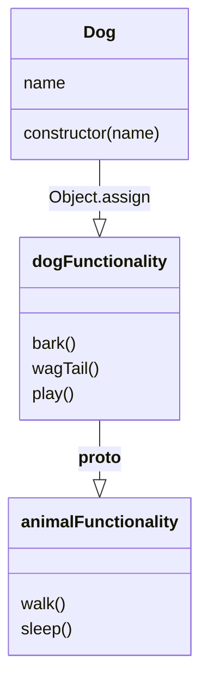

# Mixin Pattern 

```ad-flashcards
title: ## Die Flashcards
collapse:
#### ¿Qué es un mixin en Javascript?

Un mixin es un objeto que podemos usar para añadir funcionalidad reutilizable a otro objeto o clase, sin usar herencia.

#### ¿Cómo se crea y se usa un mixin en Javascript?

Se crea un objeto con los métodos que queremos añadir y se usa el método `Object.assign` para copiarlos al prototipo del objeto o clase que queremos extender.

#### ¿Cómo se puede usar herencia dentro de los mixins?

Se puede usar la propiedad `__proto__` o la función `Object.setPrototypeOf` para establecer el prototipo de un mixin como otro mixin. Así, el mixin hijo hereda los métodos del mixin padre.

#### ¿Qué ventajas tiene usar mixins en Javascript?

Los mixins permiten agregar funcionalidad a objetos o clases sin necesidad de usar herencia múltiple, que no está soportada en Javascript. Los mixins facilitan la reutilización de código y la composición de comportamientos.

#### ¿Qué desventajas tiene usar mixins en Javascript?

Los mixins pueden introducir complejidad y confusión al modificar el prototipo de los objetos o clases. Los mixins pueden causar conflictos de nombres o sobrescribir métodos existentes. Los mixins pueden dificultar el rastreo del origen de las funciones.
```

````ad-info
title: Index
collapse: 
```toc
```

````

````ad-abstract
Un mixin es un objeto que podemos usar para añadir funcionalidad reutilizable a otro objeto o clase, sin usar herencia. No podemos usar los mixins por sí solos: su único propósito es añadir funcionalidad a objetos o clases sin herencia

Los mixins facilitan la <mark class="hltr-truecyan">reutilización de código y la composición de comportamientos</mark>. Los mixins pueden usar herencia dentro de sí mismos para aprovechar los métodos de otros mixins. Los mixins pueden ser una <mark class="hltr-truecyan">forma flexible y poderosa de extender la funcionalidad de los objetos o clases</mark>. 
Sin embargo, <mark class="hltr-red">pueden introducir complejidad y confusión al modificar el prototipo de los objetos o clases</mark>. Los mixins pueden <mark class="hltr-red">causar conflictos de nombres o sobrescribir métodos </mark>existentes. Los mixins pueden <mark class="hltr-red">dificultar el rastreo del origen de las funciones</mark>. Los mixins pueden <mark class="hltr-red">violar el principio de responsabilidad única y el principio de sustitución de Liskov</mark>. Los mixins pueden ser <mark class="hltr-red">considerados una mala práctica o un antipatrón</mark> por algunos desarrolladores.
````

## 1-  Funcionamiento
Supongamos que tenemos una clase `Dog` que solo tiene una propiedad `name`, pero queremos que los perros puedan ladrar, mover la cola y jugar. En lugar de añadir estos métodos directamente a la clase `Dog`, podemos crear un mixin que los proporcione. Esto se logra <mark class="hltr-truecyan">usando `Object.assign()` cuyo target sea el [[Prototype Pattern | prototype]] de la clase</mark>
```javascript file:"mixin properties with Object.assign()" hl:22
// Class original
class Dog {
  constructor(name) {
    this.name = name;
  }
}

// Objeto con nuevas propiedades
let dogFunctionality = {
  bark() {
    console.log("Woof!");
  },
  wagTail() {
    console.log("Wagging tail!");
  },
  play() {
    console.log("Playing!");
  }
};

// copia los métodos
Object.assign(Dog.prototype, dogFunctionality);

// Ahora el Dog puede ladrar, mover la cola y jugar
let pet1 = new Dog("Daisy");
pet1.name; // Daisy
pet1.bark(); // Woof!
pet1.play(); // Playing!
```
Como se puede ver, hemos definido un objeto `dogFunctionality` que contiene los métodos que queremos añadir a la clase `Dog`. Luego usamos el método `Object.assign` para copiar estos métodos al prototipo de la clase `Dog`. De esta forma, cualquier instancia de `Dog` tendrá acceso a estos métodos, sin necesidad de heredar de otra clase.

## 2-  Mixins con herencia

<mark class="hltr-truecyan">Los mixins también pueden usar herencia dentro de sí mismos.</mark> Por ejemplo, podemos crear un mixin `animalFunctionality` que contenga métodos comunes para todos los animales, como `walk` y `sleep`, y luego hacer que el mixin `dogFunctionality` herede de él.

```javascript file:"mixin " hl:22
// Class original
class Dog {
  constructor(name) {
    this.name = name;
  }
}

// Nuevas propiedades a agregar 
let animalFunctionality = {
  walk() {
    console.log("Walking!");
  },
  sleep() {
    console.log("Sleeping!");
  }
};

// animalFunctionality se agrega a dogFuncionality
const dogFunctionality = {
  __proto__: animalFunctionality,
  bark: () => console.log("Woof!"),
  wagTail: () => console.log("Wagging my tail!"),
  play: () => console.log("Playing!"),
  walk() {
    super.walk();
  },
  sleep() {
    super.sleep();
  },
};


// copia los métodos a la class Dog
Object.assign(Dog.prototype, dogFunctionality);

// Ahora el Dog puede caminar, dormir, ladrar, mover la cola y jugar
let pet2 = new Dog("Max");
pet2.name; // Max
pet2.walk(); // Walking!
pet2.sleep(); // Sleeping!
pet2.bark(); // Woof!
pet2.play(); // Playing!
```

````ad-example
title: Diagrama de clase del ejemplo
collapse:

````


<hr class="finale">

![[bat-logo-black.png|150]]


